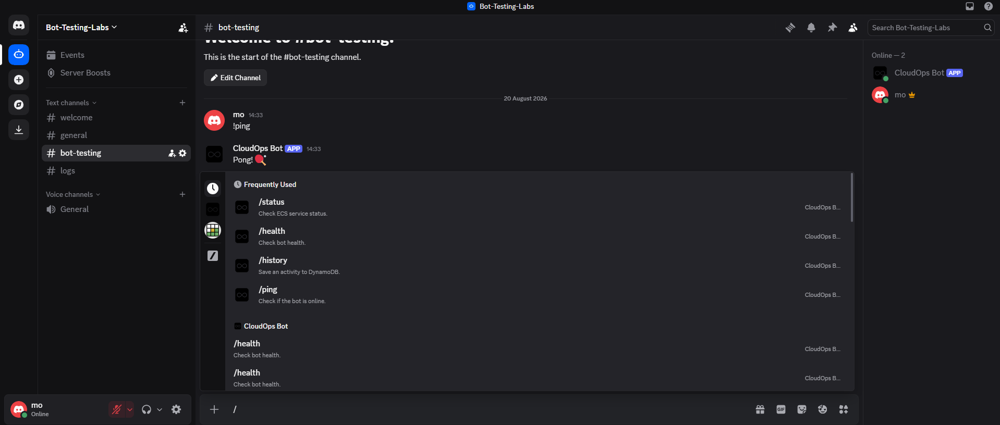

# Discord Bot AWS Deployment

## Overview

A containerised **Python Discord bot** deployed to **AWS ECS Fargate** using **Terraform, Docker and GitHub Actions**.

The bot interacts with AWS services directly through `boto3`, providing Discord commands for monitoring and interacting with the infrastructure.

### Technologies

**AWS ECS Fargate · ECR · SQS · DynamoDB · CloudWatch · Secrets Manager · Terraform · Docker · Python · discord.py · GitHub Actions · Linux · Bash**

---

## Architecture

```text
Discord
   ↓
Discord Bot
   ↓
AWS ECS Fargate
   ├── SQS
   ├── DynamoDB
   └── CloudWatch
```

The Docker image is stored in **Amazon ECR** and deployed to ECS Fargate.

The Discord bot token is stored in **AWS Secrets Manager** and injected into the container at runtime.

---

## Successful Deployment 

 

## Working App

![Working App]](image.png) 

## Bot Features

The bot currently provides:

```text
/ping       → Check the bot is online
/health     → Check bot health
/status     → Check ECS service status
/task       → Send a message to SQS
/history    → Store activity in DynamoDB
```

---

## Infrastructure

Terraform manages:

* VPC and networking
* ECR repository
* ECS Fargate cluster and service
* SQS queue and DLQ
* DynamoDB table
* CloudWatch logs and monitoring
* IAM roles and permissions
* AWS Secrets Manager

Terraform state is stored remotely using **Amazon S3 with DynamoDB locking**.

---

## CI/CD

GitHub Actions automates the deployment:

```text
Checkout
   ↓
AWS Authentication
   ↓
Build Docker Image
   ↓
Push to ECR
   ↓
Terraform Deploy
   ↓
ECS
```

---

## Security

* Bot token stored in AWS Secrets Manager
* Credentials stored using GitHub Secrets
* IAM roles used for AWS access
* `.env` excluded from Git
* Terraform remote state
* Infrastructure managed as code

---

## Local Development

Install dependencies:

```bash
pip install -r requirements.txt
```

Create `.env`:

```text
DISCORD_BOT_TOKEN=your-bot-token
```

Run:

```bash
python app/main.py
```

Or build with Docker:

```bash
docker build -t discord-bot .
```

---

## Future Improvements

* More Discord commands
* ECS auto scaling
* Automated deployments
* Better logging and error handling
* More advanced SQS processing
* Container vulnerability scanning
* Stricter IAM permissions

---

## Skills Demonstrated

**AWS · Terraform · Docker · Python · discord.py · boto3 · ECS · ECR · SQS · DynamoDB · CloudWatch · Secrets Manager · IAM · GitHub Actions · CI/CD · Linux · Bash · Infrastructure as Code**

---

## Author

**Mohamed Mahmoud Yusuf**
